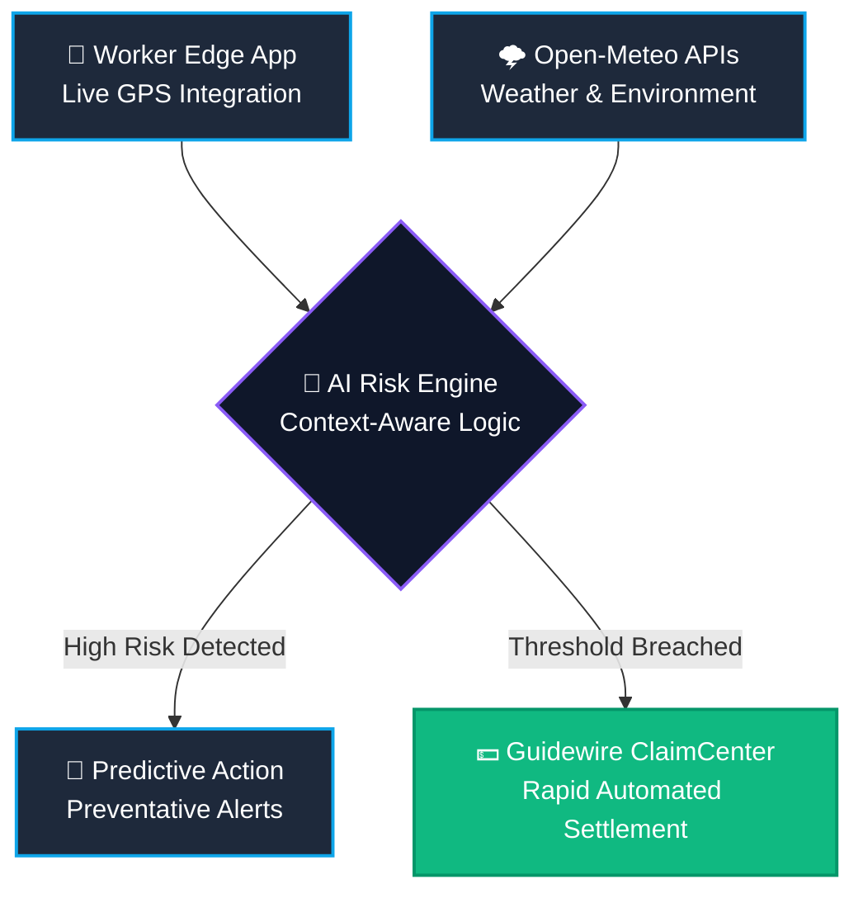

<div align="center">
  
  <br>
  <h1>🛡️ Aura-InsureKL: Context-Aware Gig Protection</h1>
  <p><strong>Transforming Reactive Insurance into Predictive Safety for Gig Workers.</strong></p>

  <p>
    <a href="https://react.dev/"></a>
    <a href="https://vitejs.dev/"></a>
    <a href="#"></a>
    <a href="#"></a>
  </p>

  <h3>
    <a href="https://youtu.be/RcAwv4KRgaU">▶️ Watch the 2-Minute Pitch Video</a>
    <span> | </span>
    <a href="https://aura-insurekl-phase3.vercel.app">🌐 View Live Dashboard Demo</a>
  </h3>
</div>

<br>

> 🏆 **Project Mission**: The Gig Economy is projected to reach **$1.5 Trillion** by 2030, yet millions lack fundamental safety nets. Aura-InsureKL acts as a **predictive digital guardian**, intervening *before* catastrophes occur.

---

## 🎯 The Problem

Insurance today is reactive—it only supports users *after* incidents happen. 
Gig workers operate in highly dynamic environments dealing with extreme weather, long working hours, and high-risk zones, but existing systems fail to adapt in real time.

## 💡 Our Solution: The Operations Nexus

We built a **Context-Aware Risk Engine** that doesn't just compensate for risks—it actively prevents them. 

### ⚙️ Key Features

1. **🧍 Current Situation Awareness**: Analyzes live geographic data, weather (floods, smog), and fatigue levels to dynamically display your real-time risk score.
2. **⚡ "Zero-Click" Parametric Policies**: If a critical threshold is breached (e.g., severe flooding detected via Open-Meteo API), the system autonomously offsets lost wages—zero claims filed.
3. **🎬 Impact Visualization**: By intercepting dangerous deliveries before they are accepted, our dashboard demonstrates a simulated **~40% reduction in incidents**.

---

## 🏗️ How It Works

Our architecture is built for rapid, real-time risk assessment and seamless synchronization with **Guidewire Core Systems**:



---

## 📈 Integration with Guidewire Core Systems

**Aura-InsureKL operates on a B2B2C model, designed specifically as an extension for Guidewire PolicyCenter and ClaimCenter.** 
Rather than existing as a disjointed app, our Operations Nexus feeds directly into the Guidewire ecosystem, allowing major gig aggregators and commercial insurers to underwrite dynamic risk safely.

* **Why they buy it**: Actively preventing accidents drastically reduces incurred losses inside ClaimCenter, while the automated parametric triggers enable 0-touch settlements.

---

## 🚀 Run the Dashboard Locally

Experience the context-aware dashboard in action:

```bash
# Clone the repository
git clone https://github.com/yourusername/aura-insurekl.git

# Enter project directory
cd aura-insurekl

# Install dependencies
npm install

# Start the dev server
npm run dev
```

Visit `http://localhost:5173` to access the live dashboard. *(Hint: Click the "Fetch Live GPS API" button or toggle the Adversarial Testing mode to see the engine in action!)*

---

<div align="center">
  <i>"We don't just insure workers — we help them make safer decisions."</i>
</div>
